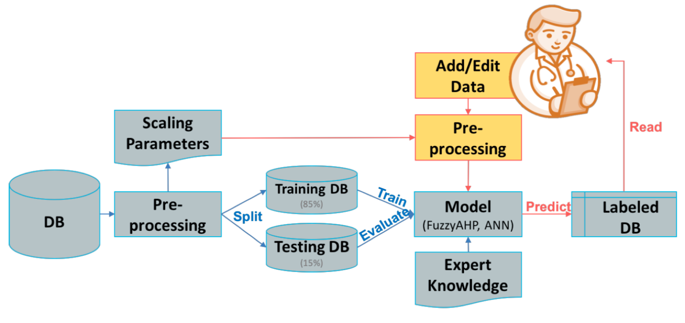
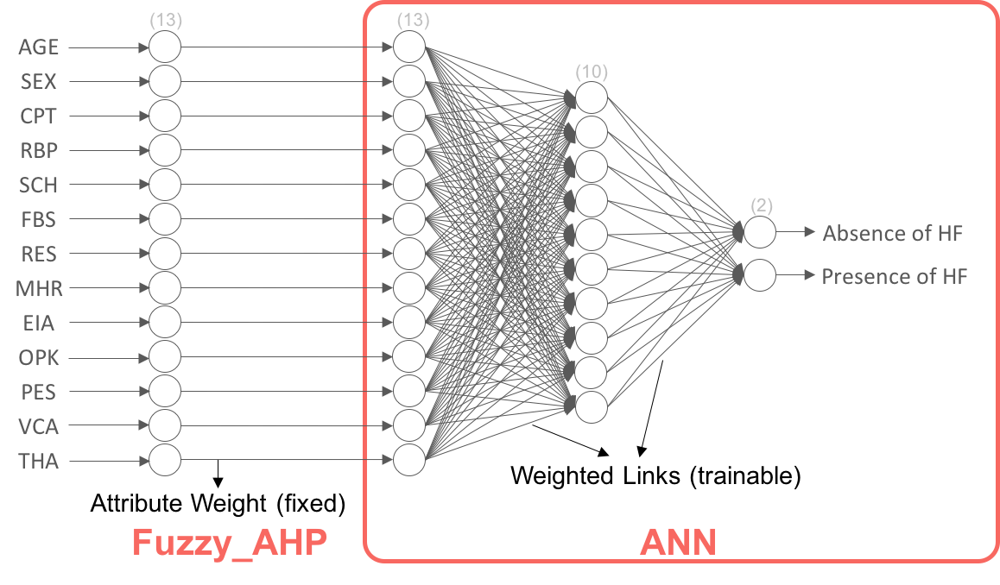
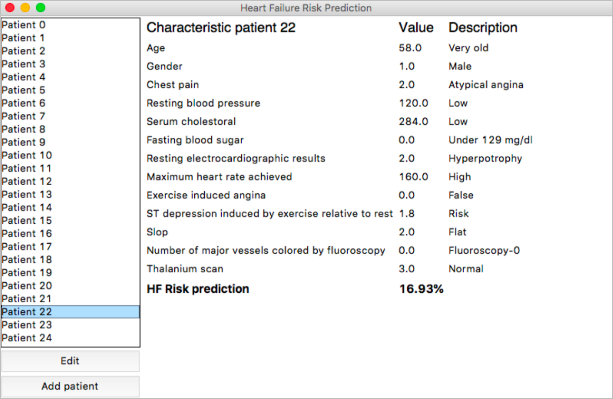

# 2018 - IDSS PW3

Team 3 - Can Fan, Daniela Furlan Gonzalez, Mathilde Polizzi, I-Chun Yeh

Reference: O.W. Samuel, G.M. Asogbon, A.K. Sangaiah, P. Fang, G. Li (2017) - An integrated decision support system based on ANN and Fuzzy_AHP for heart failure risK prediction. Expert Syst. Appl. 68, 163-172.

## Intro
- [user-interface.py](main.py) : integrate all function and add user interface.
- [test.py](test.py) : integrate all function for testing each function.
- [preprocessing.py](preprocessing.py) : load data and deal with missing data.
- [faphy.py](faphy.py) : Fuzzy_AHP using pairwise_matrix to get the attribute's weights.
- [ann.py](ann.py) : train ANN to trained ANN for prediction.
- [eval.py](eval.py) : evaluate the model, using sensitivity/specificity, evaluation metrics, ROC and performance plot.

data/ :
  - processed_data.csv : [original dataset from UCI data repository](http://archive.ics.uci.edu/ml/datasets/heart+Disease).
  - weights : attribute's weights computed from Fuzzy_AHP.

image/ : store all images and documents using in README.md
   

## Infrastructure

- Flowchart of the system 
  
  
- Model 
  

## Result

Features:
- Predict Heart Failure Risk 
- Add/Edit Patient

## Detailed

[Explanatory Paper](image/PW3Report.pdf)